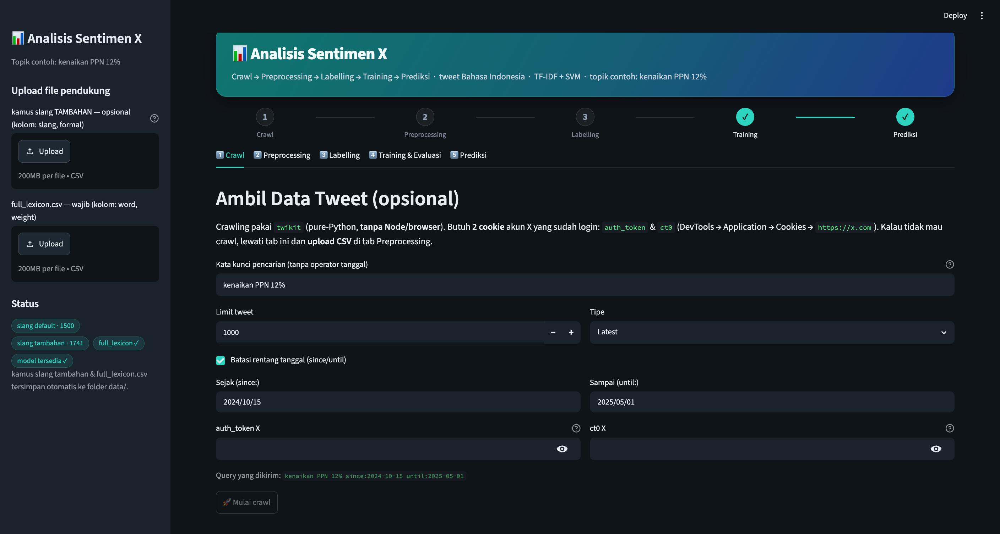

# Analisis Sentimen X

Aplikasi **analisis sentimen tweet (X/Twitter) Bahasa Indonesia** — hasil rebuild
dari 4 notebook (Projek Skripsi) - (topik contoh: **kenaikan PPN 12%**) menjadi satu aplikasi
[Streamlit](https://streamlit.io) yang tinggal pakai.

Satu layar, 5 tahap berurutan:

> **Crawl → Preprocessing → Labelling → Training (TF-IDF + SVM) → Prediksi**

Model: **TF-IDF + SVM (kernel sigmoid)** dengan **SMOTE** untuk menyeimbangkan kelas,
labelling **berbasis lexicon** (InSet-style), preprocessing Bahasa Indonesia penuh
(slang, stopword NLTK, stemming Sastrawi).



---

## Daftar Isi

1. [Fitur](#fitur)
2. [Arsitektur & Modul](#arsitektur--modul)
3. [File yang Dibutuhkan](#file-yang-dibutuhkan)
4. [Panduan Pemakaian per Tab](#panduan-pemakaian-per-tab)
5. [Detail Pipeline](#detail-pipeline)
6. [Crawling X (twikit) — Detail](#crawling-x-twikit--detail)
7. [Konfigurasi](#konfigurasi)
8. [Perbedaan vs Notebook Asli](#perbedaan-vs-notebook-asli)
9. [Troubleshooting](#troubleshooting)
10. [Catatan Keamanan](#catatan-keamanan)

---

## Fitur

- **Pipeline lengkap dalam 1 aplikasi** — dari ambil data sampai prediksi, tanpa
  pindah-pindah notebook.
- **Crawling tweet langsung di aplikasi** via `twikit` (pure-Python, tanpa Node/browser).
- **Atau lewati crawling** — upload CSV tweet yang sudah ada.
- **Preprocessing Bahasa Indonesia** — cleaning, normalisasi slang, stopword, stemming.
- **Kamus slang default bawaan** (~1500 entri) + opsi upload tambahan yang di-merge.
- **Labelling otomatis** berbasis lexicon berbobot.
- **Training SVM dengan evaluasi jujur** — held-out test set, SMOTE tanpa kebocoran data.
- **Persistensi model** — prediksi tanpa training ulang.
- **UI dark modern** — hero header, stepper progres, metric cards.

---

## Arsitektur & Modul

`app.py` adalah lapisan UI tipis; semua logika ada di paket `src/` supaya bisa
di-tes tanpa menjalankan Streamlit.

| Modul | Tanggung jawab | Fungsi/objek utama |
|-------|----------------|--------------------|
| `config.py` | Path & parameter terpusat (path data/model, param SVM, stopword tweak, env cookie). | `DATA_DIR`, `MODEL_PATH`, `SVM_BEST_PARAMS`, `ensure_dirs()` |
| `crawling.py` | Ambil tweet via twikit; bangun query; paginasi; parse respons mentah. | `crawl_tweets()`, `build_search_query()`, `select_text_column()` |
| `x_transaction_patch.py` | Tambalan agar twikit 2.3.3 bisa bicara dengan X terkini (transaction-id + query-ID). | `apply_patch()`, `resolve_search_query_id()`, `patch_search_endpoint()` |
| `preprocessing.py` | 7 tahap preprocessing teks Indonesia; muat kamus slang (default + tambahan). | `preprocess_text()`, `preprocess_dataframe()`, `load_slang_dict()` |
| `labelling.py` | Labelling sentimen berbasis skor lexicon. | `label_dataframe()`, `score_text()`, `load_lexicon()` |
| `modeling.py` | Bangun/latih pipeline TF-IDF+SVM+SMOTE; evaluasi; simpan/muat; prediksi. | `train_model()`, `save_model()`, `load_model()`, `predict()` |
| `storage.py` | Validasi kolom + simpan file upload ke path kanonik + clear cache loader. | `save_support_file()`, `validate_columns()` |

Alur data antar tahap dijaga di `st.session_state` (`df_raw` → `df_pre` → `df_label`
→ `train_result`).

---

## File yang Dibutuhkan

File pendukung **di-upload lewat sidebar aplikasi** (tidak perlu copy manual). File
yang di-upload divalidasi kolomnya lalu disimpan ke `data/` dan langsung dipakai.

| File | Kolom wajib | Status | Fungsi |
|------|-------------|--------|--------|
| **kamus slang** | `slang`, `formal` | **opsional** | normalisasi kata slang → baku |
| **`full_lexicon.csv`** | `word`, `weight` (`number_of_words` opsional) | **WAJIB** | lexicon labelling (InSet-style) |

> CSV dengan kolom wajib kurang **ditolak tanpa menimpa** file lama.

### Kamus slang: default bawaan + tambahan (merge)

Kamus slang punya **default bawaan** di `src/defaults/kamus_slang_default.csv`
(~1500 entri) yang **selalu aktif** — tahap Preprocessing & Prediksi jalan tanpa
upload apa pun.

Upload kamus slang di sidebar bersifat **tambahan**:

- Entri tambahan di-**merge di atas** default.
- Saat key bentrok, **tambahan menang** (boleh override mapping default + nambah entri).
- Kosongkan untuk pakai default saja.
- Tersimpan ke `data/kamus_slang.csv`; **hapus file itu untuk kembali ke default-only**.

### `full_lexicon.csv` (wajib)

Format InSet-style: tiap baris satu kata + bobot integer (boleh negatif).

```csv
word,weight,number_of_words
bagus,5,1
buruk,-4,1
```

`number_of_words` (n-gram) **diabaikan** — scoring unigram-only (lihat bagian
Labelling di Detail Pipeline).

Status tiap file ditampilkan sebagai badge di sidebar.

---

## Panduan Pemakaian per Tab

Sidebar (kiri): upload file pendukung + badge status + indikator model. Area utama:
hero header + **stepper progres** (langkah menyala seiring tahap selesai) + 5 tab.

### 1. Crawl (opsional)

Ambil tweet dari X. Isi:

- **Kata kunci** (tanpa operator tanggal — operator since/until diisi lewat kalender).
- **Limit tweet**, **Tipe** (Latest / Top / Media).
- **Rentang tanggal** `since`/`until` (date picker; bisa dimatikan).
- **Cookie** `auth_token` & `ct0` (lihat [Crawling X](#crawling-x-twikit--detail)).

Caption menampilkan query final yang dikirim. Hasil → `df_raw`, mengalir ke tab
Preprocessing. **Boleh dilewati** — langsung upload CSV di tab berikutnya.

### 2. Preprocessing

Input: hasil crawl **atau** upload CSV tweet. Pilih **kolom teks** (default
`full_text`). Tombol "Jalankan preprocessing" menghasilkan kolom:
`data_cleaned`, `data_token`, `data_slang`, `data_stopwords`, `data_stemmed`.
Kamus slang default selalu dipakai (+ tambahan dari sidebar bila ada). Hasil → `df_pre`.

### 3. Labelling

Beri label sentimen berbasis lexicon ke `df_pre`. Butuh `full_lexicon.csv`.
Menampilkan **distribusi sentimen** (tabel + bar chart). Hasil → `df_label` (kolom
`sentiment`: `positive` / `negative` / `neutral`).

### 4. Training & Evaluasi

Sumber data berlabel: dari tab Labelling **atau** upload CSV berlabel (kolom
`data_stemmed` + `sentiment`). Tombol "Latih model" melatih SVM, lalu menampilkan:

- **Metric cards**: Akurasi, Precision, Recall, F1 (held-out test), CV akurasi.
- **Confusion matrix** + **classification report**.

Model **otomatis disimpan** ke `models/svm_sentiment.joblib`.

### 5. Prediksi

Butuh model tersimpan. Ketik teks tweet → di-preprocessing dengan kamus yang sama →
prediksi sentimen (dengan emoji) + tampilkan teks ter-preprocessing.

---

## Detail Pipeline

### Preprocessing (`src/preprocessing.py`)

Urutan tahap (replikasi notebook `Codingan_Preprocessing_Data.ipynb`):

| # | Tahap | Keterangan |
|---|-------|------------|
| 1 | Case folding | lowercase |
| 2 | Cleaning | buang URL, `@mention`, `#hashtag`, emoji, tanda baca **kecuali `%`** |
| 3 | Expand repeated words | `"kata4"` → `"kata kata kata kata"` (bug notebook, dipertahankan) |
| 4 | Tokenizing | `RegexpTokenizer(r"\w+")` |
| 5 | Slang normalization | ganti token slang → baku via kamus (default + tambahan) |
| 6 | Stopword removal | NLTK Indonesian + tweak (`STOPWORD_REMOVE` / `STOPWORD_ADD`) |
| 7 | Stemming | Sastrawi, pada teks gabungan token (bukan string-repr list) |

### Labelling (`src/labelling.py`)

```
skor = Σ weight[token]   untuk token yang ada di lexicon (split spasi, lowercase)
skor > 0  → positive
skor < 0  → negative
skor == 0 → neutral      (termasuk kasus tak ada token cocok)
```

Unigram-only — kolom `number_of_words` diabaikan (sama seperti notebook).

### Modeling (`src/modeling.py`)

Pipeline `imblearn`:

```
TfidfVectorizer → StandardScaler(with_mean=False) → SMOTE → SVC(sigmoid)
```

- **Split**: `train_test_split` stratified, `test_size=0.2` → held-out test set sungguhan.
- **CV**: `StratifiedKFold` pada data train; SMOTE **di dalam pipeline** → resample
  hanya fold train (tanpa kebocoran ke fold validasi).
- **Adaptif kelas kecil**: jumlah fold & `k_neighbors` SMOTE menyesuaikan ukuran
  kelas terkecil agar tak error.
- **Param**: best params GridSearch (`kernel=sigmoid, C=10, coef0=1, gamma=0.0005`).
- **Persistensi**: seluruh pipeline (termasuk vectorizer) disimpan via `joblib`.

---

## Crawling X (twikit) — Detail

Tab **Crawl** memakai [`twikit`](https://github.com/d60/twikit) — memanggil API
internal X langsung lewat cookie sesi. **Tanpa Node.js, tanpa browser.** (Mesin lama
`tweet-harvest` dibuang karena bergantung Playwright/Chromium yang CDN-nya mati.)

### Butuh 2 cookie akun X yang sudah login

Ambil dari **DevTools → Application → Cookies → `https://x.com`**:

| Cookie | Fungsi |
|--------|--------|
| `auth_token` | token sesi (~40 hex) |
| `ct0` | CSRF token (~160 hex) — X menolak request tanpa header `X-Csrf-Token` |

Isi lewat field di tab Crawl, atau env var sebelum menjalankan:

```bash
export X_AUTH_TOKEN="<auth_token>"
export X_CT0="<ct0>"
```

> **Ambil dari sesi yang sama**, dan **login dulu** (kalau belum, `auth_token` tak ada).
> Cookie kedaluwarsa saat logout / ganti password → ambil ulang.

### Patch lokal anti-bot X (⚠️ RAPUH)

X mewajibkan header `x-client-transaction-id` (anti-bot) di tiap request API. twikit
`2.3.3` (rilis terbaru) men-generate-nya **tapi rusak** terhadap X terkini di 3 lapis.
`src/x_transaction_patch.py` + `src/crawling.py` menambal ketiganya:

| Lapis rusak di twikit 2.3.3 | Gejala | Tambalan |
|------------------------------|--------|----------|
| `get_indices` cari `ondemand.s` pakai pola lama | init transaction gagal → 404 | override `get_indices`: temukan `ondemand.s` via map webpack id→nama→hash di HTML home |
| query-ID GraphQL `flaR-…` sudah dirotasi X | 404 | resolve query-ID terbaru dari bundle JS X (fallback ke ID hardcoded) |
| kelas `Tweet`/`User` baca `created_at`/`screen_name` dari `legacy` (X pindah ke `core`) | 0 tweet (KeyError ditelan twikit) | parse respons GraphQL mentah sendiri, ambil 5 field dengan fallback |

**Kerapuhan disengaja & diketahui.** Ketiga tambalan bergantung format bundle/respons
X yang **berubah tiap deploy frontend (harian/mingguan)**. Kalau crawl tiba-tiba 404 /
0 tweet lagi: format X berubah — periksa HTML home `https://x.com` (map webpack &
query-ID) + struktur respons search, lalu sesuaikan regex/path di kedua file itu.

### Diagnostik di luar Streamlit

`diagnose_crawl.py` menguji crawl tanpa gangguan cache modul Streamlit:

```bash
X_AUTH_TOKEN="<...>" X_CT0="<...>" .venv/bin/python diagnose_crawl.py
```

Mencetak versi twikit, status cookie, lalu coba ambil 5 tweet + traceback penuh bila gagal.

### Alternatif tanpa crawl

Upload CSV hasil crawl yang sudah ada (mis. `Data_Crawling_Bersih.csv` /
`datasetSelected`) langsung di tab Preprocessing — lewati tab Crawl sepenuhnya.

Tab Preprocessing juga menerima export lokal TweetClaw/OpenClaw (`.json`,
`.jsonl`, `.ndjson`, atau `.csv`). Export ini dinormalisasi ke kolom `full_text`,
sehingga hasil review TweetClaw bisa langsung masuk ke pipeline preprocessing,
labelling, training, dan prediksi tanpa crawl ulang.

---

## Konfigurasi

Semua di `src/config.py`:

| Konstanta | Nilai / Arti |
|-----------|--------------|
| `DATA_DIR`, `MODELS_DIR` | folder `data/` & `models/` |
| `DEFAULT_SLANG_PATH` | kamus slang bawaan (`src/defaults/...`) |
| `SLANG_PATH` | kamus slang tambahan hasil upload (`data/kamus_slang.csv`) |
| `LEXICON_PATH` | `data/full_lexicon.csv` (wajib) |
| `MODEL_PATH` | `models/svm_sentiment.joblib` |
| `LABELS` | `("positive", "neutral", "negative")` |
| `SVM_BEST_PARAMS` | `{kernel: sigmoid, C: 10, coef0: 1, gamma: 0.0005}` |
| `RANDOM_STATE` | `42` |
| `TEST_SIZE` | `0.2` (held-out test) |
| `STOPWORD_REMOVE` | `{hari, apa, ada, lama}` — dikeluarkan dari stopword |
| `STOPWORD_ADD` | `{aja, halo, eh}` — ditambahkan jadi stopword |
| `X_AUTH_TOKEN`, `X_CT0` | cookie X dari env var (default kosong) |

---

## Perbedaan vs Notebook Asli

| Hal | Notebook asli | Di aplikasi ini |
|-----|---------------|-----------------|
| SMOTE | dijalankan **sebelum** split CV → bocor ke fold validasi, akurasi 92% over-optimistic | SMOTE **di dalam** `imblearn.Pipeline`, hanya resample fold train |
| GridSearch | param terbaik dicetak tapi tak dipakai | dipakai sebagai default model |
| Test set | `x_test`/`x_val` dibuat tapi tak pernah dievaluasi | held-out test set sungguhan |
| Stemming | men-stem string-repr list `"['pajak','naik']"` | join token jadi kalimat dulu baru stem |
| Persistensi | model tak disimpan | disimpan `joblib` → prediksi tanpa training ulang |
| SMOTE k_neighbors | default 6, error kalau kelas kecil | adaptif ke ukuran kelas terkecil per fold |
| Crawl | tweet-harvest (Node + Playwright) | twikit (pure-Python) + patch anti-bot |

---

## Troubleshooting

| Gejala | Kemungkinan sebab & solusi |
|--------|----------------------------|
| `Gagal crawl: status: 404` | Format bundle X berubah → patch anti-bot perlu disesuaikan (lihat [Crawling](#patch-lokal-anti-bot-x--rapuh)). Atau query-ID dirotasi. |
| `Gagal crawl: ... running event loop` | Streamlit lama; sudah ditangani `_run_async` — pastikan **restart total** Streamlit. |
| Crawl berhasil tapi **0 tweet** | Skema respons X berubah (field pindah) → sesuaikan `_entry_to_row` di `crawling.py`. Atau akun rate-limited. |
| `401/403` saat crawl | Cookie salah/kedaluwarsa, atau `auth_token`+`ct0` beda sesi → ambil ulang. |
| Labelling error `full_lexicon.csv tidak ada` | Upload `full_lexicon.csv` di sidebar (wajib). |
| Tema tidak berubah | `.streamlit/config.toml` butuh **restart total** Streamlit, lalu hard refresh browser (Cmd+Shift+R). |
| twikit gagal di-import | venv masih Python 3.9 → buat ulang dengan Python 3.12. |

---

## Catatan Keamanan

- Cookie `auth_token` / `ct0` = **kredensial sesi penuh** akun X. Siapa pun yang
  memilikinya bisa mengakses akunmu **tanpa password**. Jangan commit / share / hardcode.
- Scraping pakai cookie sesi **melanggar ToS X**; akun bisa kena rate-limit / suspend.
  Disarankan pakai akun "throwaway", bukan akun utama.
- `data/` & `models/` berisi data/artefak lokal — pertimbangkan untuk tidak meng-commit
  cookie atau dataset sensitif.
